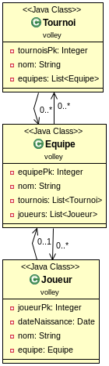

# Many to Many relationship

#### Le modèle

Voici la relation que l'on souhaite réaliser :

#### Cahier des charges

Nous souhaitons créer une application web qui diffuse l'api rest (les retours au format json) suivante :
- /tournois : retourne la liste de tous les tournois
- /equipes : retourne la liste de tous les equipes
- /joueurs : retourne la liste de tous les joueurs
- /init : supprime tous les enregistrements et crée un groupe qui possède plusieurs étudiants

#### Implémentation

Pour réaliser ceci, vous allez utiliser le framework hibernate pour la persistence des données et le framework springboot pour structurer votre projet.

Vous pourrez suivre les étapes suivantes :
- [ ] création du modèle
- [ ] ajout des annotations de persistance
- [ ] création des repository
- [ ] création de l'application principale
- [ ] configuration de la base de donnée

On teste que cette première partie se lance sans erreur ...

- [ ] création d'un service qui implémente les trois fonctions de l'api
- [ ] test depuis l'application en commandLineRunner
- [ ] création du controller rest pour diffuser l'api

#### Les annotations du modèle

On peut mettre les annotations devant la classe (pour la table), les attributs ou les méthodes (pour les colonnes).

* définir la table
@Entity : pour définir que la classe est une entité (donc qu'elle va persister en bd)
@Table(name="XXX") : si vous voulez spécifier le nom de la table qui servira à la stocker (optionnel)

* définir les colonnes
@Id : à mettre pour les primary key
@GenratedValue(strategy = GenerationType.XXX) : pour que la création du pk soit gérée par la bd, on peut choisir identity
@Column : si vous voulez spécifier le nom de la colonne, et d'autres choses (optionnel)

* définir la multiplicité (dans une des deux classes)
@ManyToMany
@JoinTable : pour indiquer le nom de la table de jointure, ainsi que les deux fk

* définir la multiplicité (dans l'autre)
@ManyToMany(mappedBy="XXX") : le nom de l'attribut fk dans l'entité liée